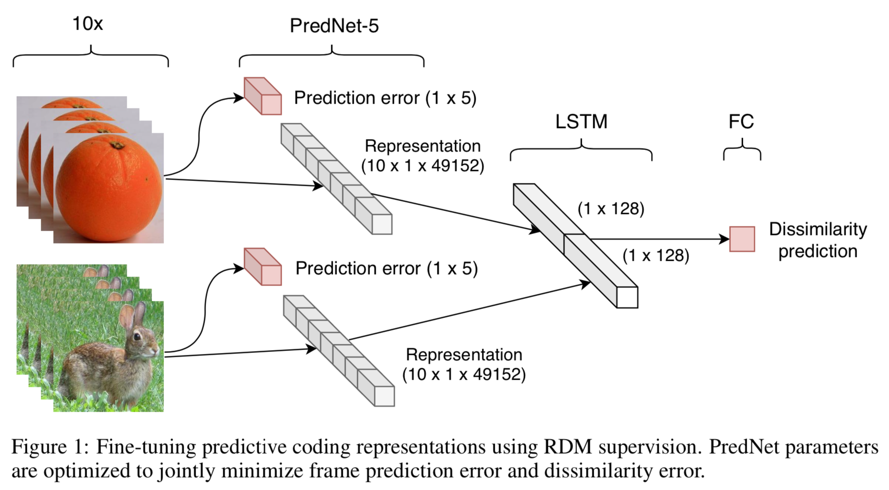

# PredNet - Algonauts
Deep predictive coding networks are neuroscience-inspired unsupervised 
learning models that learn to predict future sensory states. We build upon the 
[PredNet](https://coxlab.github.io/prednet/) implementation by 
Lotter, Kreiman, and Cox (2016) to investigate if predictive coding 
representations are useful to predict brain activity in the visual cortex. 
We use representational similarity analysis (RSA) to compare PredNet 
representations to functional magnetic resonance imaging (fMRI) and 
magnetoencephalography (MEG) data from the Algonauts Project (Cichy etal., 2019).  

In contrast to previous findings in the literature (Khaligh-Razavi &Kriegeskorte, 2014), 
we report empirical data suggesting that unsupervised models trained to predict frames 
of videos may outperform supervised image classification baselines. 
Our best submission achieves an average noise-normalized score of 16.67% 
and 27.67% on the fMRI and MEG tracks of the 
[Algonauts Challenge](http://algonauts.csail.mit.edu/challenge.html).

## Contributions

* We find that a predictive coding model trained on videos captured with 
a car-mounted camera (Lotter et al., 2016) outperforms AlexNet 
(Krizhevsky, Sutskever, & Hinton, 2012) in terms of correlation to RDMs 
from human data. Moreover, as we further train the model on additional videos 
from the Moments in Time dataset (Monfort et al., 2018), the model internal 
representations become more similar to brain activity. 

* Second, we propose an end-to-end method to fine-tune predictive coding 
representations using joint supervision from frame prediction errors and 
IT dissimilarity scores. Our PredNet-IT model improves the noise-normalized 
correlation to human IT from 9.82% to 15.93% on the Algonauts Challenge test 
set (Cichy et al., 2019).

* Lastly, we show that concatenating representations of PredNet-IT, and 
AlexNet improve our best MEG late interval correlation score from 17.15% to 
27.90%, which suggests these models capture complementary information relevant 
to visual recognition.

  

## Code

This repository contains supporting code for PredNet training, fine-tuning, 
feature extraction, and evaluation. We also use the [Algonauts development kit](http://algonauts.csail.mit.edu/challenge.html), 
which is not distributed here. Experiment workflow is as follows:
 
* [PredNet training](./prednet_train.ipynb) on videos
* [PredNet fine-tuning](./prednet_finetune.ipynb) using RDM supervision
* [Feature extraction](./prednet_features.ipynb)
* [Evaluation](./prednet_evaluation.ipynb) using representational dissimilarity analysis (RSA) 